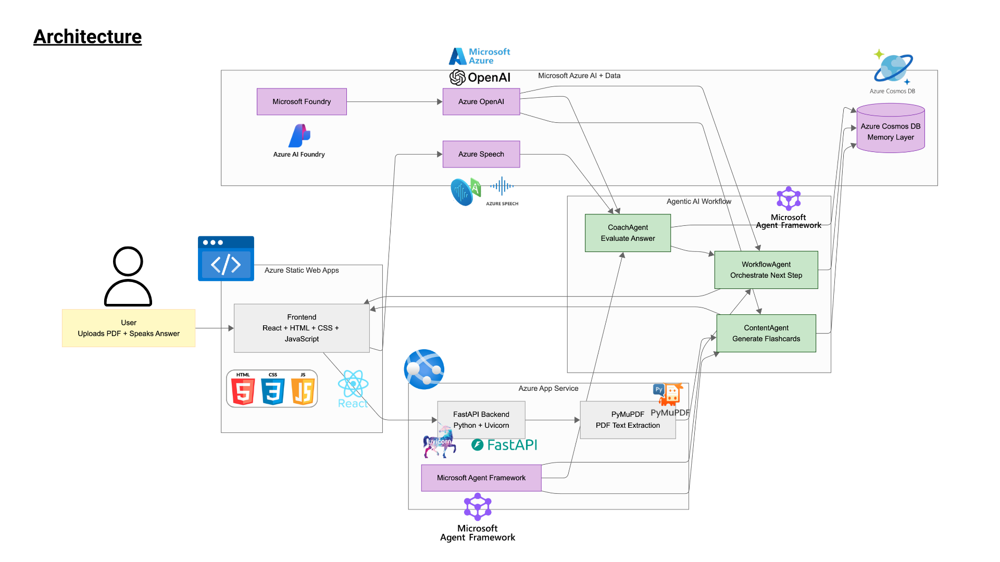

# Yapping Study Buddy

An agentic AI active-recall study companion that turns lecture PDFs into speaking-based flashcards.

Yapping Study Buddy is an online flashcard tool, but instead of only reading and flipping cards silently, users answer by speaking. The system transcribes the spoken answer, evaluates semantic concept coverage, and decides whether the user should move on, retry with a hint, or reveal the answer.

## Website Preview


Website Link: [https://yellow-moss-0a08bda1e.7.azurestaticapps.net/](https://yellow-moss-0a08bda1e.7.azurestaticapps.net/)

## Table of Contents

1. [Architecture Overview](#architecture-overview)
2. [Architecture Diagram](#architecture-diagram)
3. [Problem Statement](#problem-statement)
4. [Approach](#approach)
5. [Agentic AI Design](#agentic-ai-design)
6. [Microsoft Azure Services](#microsoft-azure-services)
7. [Pipeline Flow](#pipeline-flow)
8. [Sample Workflow](#sample-workflow)
9. [Tech Stack](#tech-stack)
10. [Getting Started](#getting-started)
11. [Screenshots](#screenshots)
12. [Current Working Features](#current-working-features)
13. [Future Improvements](#future-improvements)

## Architecture Overview

- **Frontend:** React, HTML, CSS, JavaScript
- **Backend:** Python FastAPI
- **PDF Processing:** PyMuPDF
- **AI Agents:** ContentAgent, CoachAgent, WorkflowAgent
- **AI Model Access:** Azure OpenAI through Microsoft Foundry
- **Agent Framework:** Microsoft Agent Framework
- **Speech Service:** Azure Speech
- **Persistent Memory:** Azure Cosmos DB
- **Deployment:** Azure Static Web App and Azure App Service

## Architecture Diagram



## Problem Statement

Traditional flashcards are useful, but they have three main problems:

1. **Passive learning:** users often read and check answers silently without actively producing the answer.
2. **Manual card creation:** creating flashcards from lecture slides is time-consuming because users need to transfer questions one by one.
3. **No adaptive feedback:** traditional flashcards usually do not evaluate the user's answer or decide what the user should study next.

Yapping Study Buddy solves this by turning the Gen Z habit of "yapping" into a structured active-recall workflow. Instead of only reading flashcards, users explain answers out loud. The system transcribes the spoken answer, evaluates semantic understanding, and guides the next study step.

## Approach

The solution follows an agentic AI workflow:

1. The user uploads a lecture PDF.
2. The backend extracts text from the PDF.
3. ContentAgent generates flashcards, ideal answers, and keywords.
4. The user answers each flashcard by speaking.
5. Azure Speech converts the spoken answer into a transcript.
6. CoachAgent evaluates the answer based on semantic similarity and concept coverage.
7. WorkflowAgent decides the next action using the evaluation result and session state.
8. Azure Cosmos DB stores generated flashcards, user answers, evaluations, decisions, and previous sessions.

This design turns a static flashcard experience into an adaptive study loop: **generate → speak → evaluate → decide → remember**.

## Agentic AI Design

The system uses three agents with separate responsibilities. This makes the architecture more modular, interpretable, and easier to control than using one large prompt for the entire workflow.

### 1. ContentAgent

ContentAgent converts extracted lecture text into structured study material.

**Responsibilities:**

- Generate an exam-focused summary.
- Identify important topics.
- Generate exactly 10 active-recall questions.
- Generate ideal answers.
- Extract keywords for hints and evaluation.
- Return structured JSON for the frontend.

**Why use an agent for flashcard generation?**

A basic keyword extractor or rule-based generator can identify frequent words, but it cannot reliably understand lecture structure, topic importance, or question usefulness. ContentAgent uses LLM-based semantic understanding to detect high-value concepts, definitions, comparisons, workflows, repeated ideas, and exam-style topics.

The generated keywords are not only display hints. They also act as lightweight semantic anchors for evaluation. They help CoachAgent check whether the user's answer covers the core concepts, even when the wording is different.

Example output structure:

```json
{
  "summary": "string",
  "topics": ["topic1", "topic2"],
  "questions": [
    {
      "id": "q1",
      "topic": "string",
      "question": "string",
      "idealAnswer": "string",
      "keywords": ["keyword1", "keyword2"],
      "sourceChunkIds": ["chunk-1"]
    }
  ]
}
```

### 2. CoachAgent

CoachAgent evaluates the user's spoken answer.

**Responsibilities:**

- Compare the transcript with the ideal answer.
- Evaluate semantic meaning, not only exact keyword overlap.
- Score concept coverage.
- Detect matched keywords.
- Detect missing concepts.
- Generate feedback.
- Recommend the next learning action.

**Why use an evaluation agent instead of basic evaluation?**

A basic evaluation method, such as exact keyword matching, cosine similarity, or string overlap, can miss semantically correct answers that use different wording. It can also over-score answers that mention keywords without explaining the concept correctly.

CoachAgent is used because LLM-based evaluation can perform semantic matching, concept coverage analysis, and natural language inference. This allows the system to evaluate whether the user's explanation actually means the same thing as the ideal answer, even if the surface text is different.

Example output:

```json
{
  "questionId": "q1",
  "score": 0.72,
  "matchedKeywords": ["evaporation", "condensation"],
  "missingConcepts": ["runoff"],
  "feedback": "You explained evaporation and condensation well, but missed runoff.",
  "recommendation": "hint_retry"
}
```

### 3. WorkflowAgent

WorkflowAgent is the study-session manager.

**Responsibilities:**

- Read the CoachAgent evaluation result.
- Track session state.
- Track retry count by question.
- Track weak topics and answer history.
- Decide the next action.
- Support user-specific study decisions.

Decision rules:

```text
If score >= 0.8:
    action = advance

Else if score >= 0.5 and retry count is 0:
    action = hint_retry

Else:
    action = reveal_and_move
```

Example output:

```json
{
  "action": "hint_retry",
  "questionId": "q1",
  "messageToUser": "Good attempt. Try again with this hint.",
  "retryAllowed": true
}
```

WorkflowAgent makes the system agentic because it performs user decision-making rather than only returning a static answer. It uses the current evaluation and session memory to decide whether the user should advance, retry, or reveal the answer.

## Microsoft Azure Services

This project leverages Microsoft services across the full learning loop.

| Microsoft Service | Role in this project |
|---|---|
| **Azure OpenAI / Microsoft Foundry** | Powers ContentAgent, CoachAgent, and WorkflowAgent using LLM reasoning. |
| **Microsoft Agent Framework** | Structures the system into multiple agents with clear responsibilities. |
| **Azure Speech** | Converts the user's spoken answer into text for evaluation. |
| **Azure Cosmos DB** | Provides persistent memory for sessions, flashcards, answers, evaluations, decisions, and weak topics. |
| **Azure Static Web App** | Hosts the frontend. |
| **Azure App Service** | Hosts the FastAPI backend. |

## Pipeline Flow

```text
User uploads PDF
        ↓
Backend saves uploaded file
        ↓
PDF text is extracted
        ↓
ContentAgent generates:
- summary
- topics
- 10 flashcard questions
- ideal answers
- keywords
        ↓
Generated session is saved to Azure Cosmos DB
        ↓
Frontend displays flashcard learning page
        ↓
User answers by speaking
        ↓
Azure Speech transcribes spoken answer
        ↓
CoachAgent evaluates semantic concept coverage
        ↓
WorkflowAgent decides:
- advance
- hint_retry
- reveal_and_move
        ↓
Review page displays transcript, feedback, and decision
        ↓
Next session can focus on weak or hint_retry cards
```

## Sample Workflow

### User action
```
The user uploads a lecture PDF and starts a flashcard session.
```

### Application workflow

```
1. Extract lecture text
The backend extracts readable text from the PDF using PyMuPDF.

2. Generate flashcards
ContentAgent uses Azure OpenAI through Microsoft Foundry to generate summary, topics, questions, ideal answers, keywords, and source chunk IDs.

3. Record spoken answer
The user answers the question by speaking through the frontend.

4. Transcribe speech
Azure Speech converts the user's audio into text.

5. Evaluate answer
CoachAgent evaluates semantic correctness, concept coverage, matched keywords, missing concepts, and answer quality.

6. Decide next action
WorkflowAgent uses the score, recommendation, retry count, weak topics, and session history to decide whether the user should advance, retry with a hint, or reveal the answer.

7. Store memory
Azure Cosmos DB stores the session data so the system can later support old flashcards, weak-topic review, and personalized retry sessions.
```

## Tech Stack

### Frontend

- React
- HTML
- CSS
- JavaScript

### Backend

- Python
- FastAPI
- Uvicorn
- PyMuPDF

### AI and Cloud Services

- Azure OpenAI
- Microsoft Foundry
- Microsoft Agent Framework
- Azure Speech
- Azure Cosmos DB
- Azure App Service
- Azure Static Web App

## Getting Started

### Prerequisites

Before running the project, make sure you have:

- Python 3.11+
- Azure subscription
- Azure OpenAI / Microsoft Foundry project
- Azure Speech resource
- Azure Cosmos DB account
- Node.js or a simple local HTTP server for the frontend

## Installation

This project can run in two modes:

**Local development mode**
- Frontend: `http://localhost:5500`
- Backend: `http://127.0.0.1:8000`
- The backend still connects to Azure Cosmos DB, Azure Speech, Azure OpenAI, and Microsoft Foundry.

**Cloud deployment mode**
- Frontend: Azure Static Web Apps
- Backend: Azure App Service
- The deployed frontend is hosted on Azure Static Web Apps:

```text
https://yellow-moss-0a08bda1e.7.azurestaticapps.net
```

### 1. Clone the repository

```bash
git clone https://github.com/juliairsalina/agentic-study-companion.git
cd agentic-study-companion
```

### 2. Create backend environment file

Create a `.env` file inside the `backend/` folder:

```bash
cd backend
touch .env
```

Configure the following variables:

| Environment Variable | Example Value | Description |
|---|---|---|
| `FOUNDRY_PROJECT_ENDPOINT` | `https://your-resource-name.openai.azure.com/api/projects/your-project-name` | Microsoft Foundry project endpoint used by the agents. |
| `FOUNDRY_MODEL` | `gpt-4.1-mini` | Model deployment used by ContentAgent, CoachAgent, and WorkflowAgent. |
| `AZURE_OPENAI_API_KEY` | `*****` | API key for Azure OpenAI access. Do not expose publicly. |
| `AZURE_SPEECH_KEY` | `*****` | Azure Speech resource key for speech-to-text transcription. |
| `AZURE_SPEECH_REGION` | `koreacentral` | Azure region for the Speech resource. |
| `APP_HOST` | `0.0.0.0` | Host address for running the backend server. |
| `APP_PORT` | `8000` | Port number for the FastAPI backend. |
| `COSMOS_DB_ENDPOINT` | `https://database-endpoint.documents.azure.com` | Azure Cosmos DB endpoint for storing study sessions. |
| `COSMOS_DB_KEY` | `*****` | Azure Cosmos DB access key. Do not expose publicly. |
| `COSMOS_DB_DATABASE` | `YappingStudyBuddy` | Cosmos DB database name. |
| `COSMOS_DB_CONTAINER` | `sessions` | Cosmos DB container name for storing sessions. |

See 

### 3. Install backend dependencies

Inside the `backend/` folder:

```bash
python -m venv .venv
source .venv/bin/activate
pip install -r requirements.txt
```

### 4. Configure frontend backend URL

Before running locally or deploying, update the backend URL in:

```text
frontend/index.html
```

For cloud deployment, I use the Azure App Service backend URL:

```html
<script>
  window.APP_CONFIG = {
    BACKEND_BASE: "https://yapping-study-buddy.azurewebsites.net"
  };
</script>
```

For local development, use:

```html
<script>
  window.APP_CONFIG = {
    BACKEND_BASE: "http://127.0.0.1:8000"
  };
</script>
```


### 5. Run backend locally

Inside the `backend/` folder:

```bash
uvicorn app.main:app --reload --port 8000
```

Backend URL:

```text
http://127.0.0.1:8000
```

API documentation:

```text
http://127.0.0.1:8000/docs
```

### 6. Run frontend locally

Open another terminal from the project root:

```bash
cd frontend
python3 -m http.server 5500
```

Frontend URL:

```text
http://localhost:5500
```

### 7. Verify local connection

Open the frontend:

```text
http://localhost:5500
```

Then open the browser console and run:

```js
window.APP_CONFIG.BACKEND_BASE
```

For local development, it should return:

```text
http://127.0.0.1:8000
```

Test the backend connection:

```js
fetch(window.APP_CONFIG.BACKEND_BASE + "/")
  .then(r => r.json())
  .then(console.log)
  .catch(console.error)
```

Expected result:

```json
{
  "message": "Study Companion API is running"
}
```

## Screenshots

### Upload Page


### Flashcard Page


### Review Page


## Current Working Features

- PDF upload
- PDF text extraction
- ContentAgent flashcard generation
- Multilingual question generation
- Flashcard carousel learning page
- Hint keyword display
- Spoken answer recording
- Azure Speech transcription
- CoachAgent semantic evaluation
- WorkflowAgent decision-making
- Session state tracking
- Cosmos DB session saving
- Old flashcard access
- Retry session for hint_retry cards
- Azure cloud deployment

## Future Improvements

- Add login and user-specific study history.
- Add progress dashboard and learning analytics.
- Add Azure AI Search for retrieval-augmented generation.
- Add multi-language speech recognition.
- Add stronger long-term memory for personalized weak-topic review.
- Add study streaks and adaptive spaced repetition.
