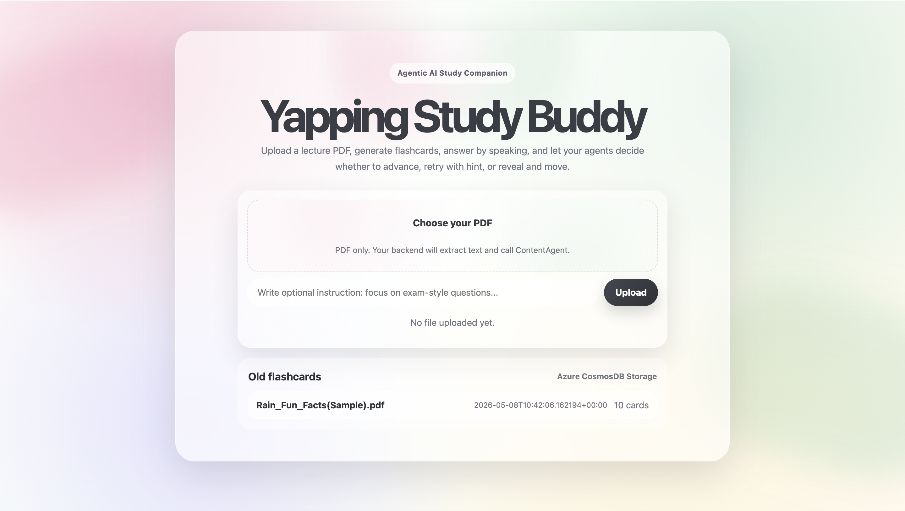
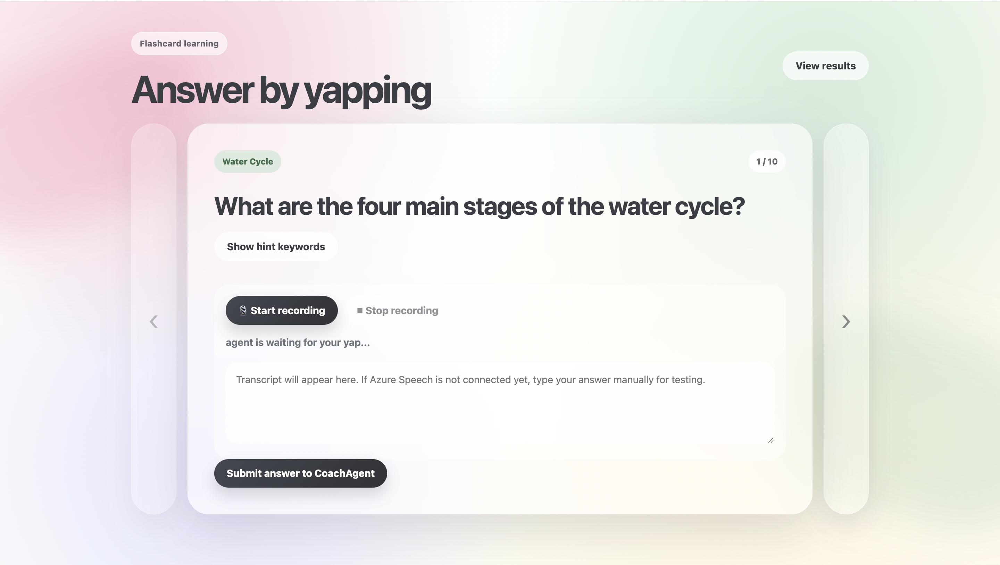
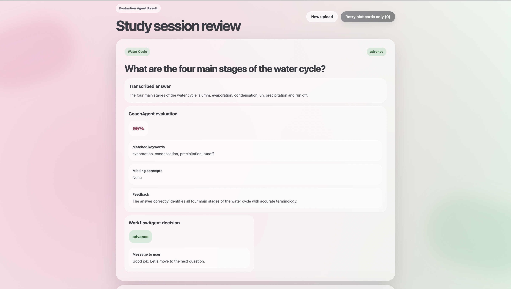

# Yapping Study Buddy
An agentic AI active-recall study companion that turns lecture PDFs into speaking-based flashcards.

## Website Preview

[](https://yellow-moss-0a08bda1e.7.azurestaticapps.net/)

Click the image to open the interactive website.

## Overview

Yapping Study Buddy helps students study more actively by combining automatic flashcard generation, spoken answer practice, AI evaluation, and workflow decision-making.

Traditional flashcards are useful, but they have three main problems:

1. They can still become passive study because users often just read and check answers silently.
2. Creating flashcards manually is time-consuming because users need to transfer questions one by one.
3. Traditional flashcards usually do not evaluate the user's answer or decide whether the user should retry or move on.

This project uses the current Gen Z habit of “yapping” as a learning method. Instead of only reading flashcards, users explain their answer out loud. The system transcribes the spoken answer, evaluates it, and guides the next study step.

## Main Features

- Upload lecture PDF.
- Extract text from the PDF.
- Generate AI summary, topics, and flashcard questions.
- Study using a carousel flashcard interface.
- Show or hide hint keywords.
- Record spoken answers.
- Transcribe speech using Azure Speech.
- Evaluate answers using CoachAgent.
- Decide next action using WorkflowAgent.
- Save old flashcards using Azure Cosmos DB.
- Retry only cards marked as hint_retry by Workflow Agent.

## Pipeline Flow

```text
User uploads PDF
        ↓
Backend saves uploaded file
        ↓
PDF text is extracted
        ↓
ContentAgent generates:
- summary
- topics
- 10 flashcard questions
- ideal answers
- keywords
        ↓
Generated session is saved to Azure Cosmos DB
        ↓
Frontend displays flashcard learning page
        ↓
User answers by speaking
        ↓
Azure Speech transcribes spoken answer
        ↓
CoachAgent evaluates answer
        ↓
WorkflowAgent decides:
- advance
- hint_retry
- reveal_and_move
        ↓
Review page displays answer, feedback, and decision
        ↓
Next session can focus only on hint_retry cards
```

## Architecture

```text
Frontend
HTML / CSS / JavaScript / React
        ↓
FastAPI Backend
        ↓
Agents and Azure Services
        ↓
Database / Memory Layer
```

### Architecture Description

The user uploads a PDF from the frontend. The backend saves the uploaded file and extracts text from the PDF. The extracted text is sent to ContentAgent, which generates an exam-focused summary, important topics, and flashcard questions.

The generated flashcard session is saved in Azure Cosmos DB. Cosmos DB works as the memory layer of the system. It stores old flashcards, summaries, questions, answers, evaluations, and workflow decisions.

During the study session, the user answers each question by speaking. Azure Speech transcribes the spoken answer into text. CoachAgent evaluates the transcript by comparing it with the ideal answer and required keywords. WorkflowAgent then decides whether the user should advance, retry with a hint, or reveal the answer and move on.

## Agents

### 1. ContentAgent

ContentAgent reduces the burden of manually creating flashcards.

Responsibilities:

- Read extracted lecture text.
- Generate an exam-focused summary.
- Identify important topics.
- Create 10 study questions.
- Generate ideal answers.
- Extract keywords for hints.

### 2. CoachAgent

CoachAgent evaluates the user's spoken answer.

Responsibilities:

- Compare the transcript with the ideal answer.
- Score the answer.
- Detect matched keywords.
- Detect missing concepts.
- Give feedback.

Example output:

```json
{
  "questionId": "q1",
  "score": 0.72,
  "matchedKeywords": ["evaporation", "condensation"],
  "missingConcepts": ["runoff"],
  "feedback": "You explained evaporation and condensation well, but missed runoff.",
  "recommendation": "hint_retry"
}
```

### 3. WorkflowAgent

WorkflowAgent decides the next learning action after evaluation.

Decision rules:

```text
If score >= 0.8:
    action = advance

Else if score >= 0.5 and retry count is 0:
    action = hint_retry

Else:
    action = reveal_and_move
```

Example output:

```json
{
  "action": "hint_retry",
  "questionId": "q1",
  "messageToUser": "Good attempt. Try again with this hint.",
  "retryAllowed": true
}
```

## Azure Cosmos DB

Azure Cosmos DB is used to store study sessions.

It stores:

- PDF filename
- study instruction
- summary
- topics
- generated questions
- user answers
- evaluations
- workflow decisions

Current database setup:

```text
Database name: YappingStudyBuddy
Container name: sessions
Partition key: /userId
Default userId: demo-user
```

Cosmos DB improves the system because users can access old flashcards and the system can later create personalized retry sessions based on weak cards.

## Azure Speech

Azure Speech is used to transcribe the user's spoken answer.

Flow:

```text
User records answer
        ↓
Frontend sends audio to backend
        ↓
Backend sends audio to Azure Speech
        ↓
Azure Speech returns transcript
        ↓
Transcript is evaluated by CoachAgent
```

## Tech Stack

### Frontend

- HTML
- CSS
- JavaScript
- React

### Backend

- Python
- FastAPI
- Uvicorn
- PyMuPDF

### AI and Cloud Services

- Azure OpenAI
- Microsoft Foundry
- Microsoft Agent Framework
- Azure Speech
- Azure Cosmos DB
- Azure App Service
- Azure Static Web App

## Setup

### 1. Clone the repository

```bash
git clone <your-repository-url>
cd study-companion
```

### 2. Create backend environment file

Create a `.env` file inside the `backend/` folder.

```bash
cd backend
touch .env
```

Fill in the `.env` file:

```env
FOUNDRY_PROJECT_ENDPOINT=https://your-resource-name.openai.azure.com/api/projects/your-project-name
FOUNDRY_MODEL=gpt-4.1-mini
AZURE_OPENAI_API_KEY=*****

AZURE_SPEECH_KEY=*****
AZURE_SPEECH_REGION=your-location

APP_HOST=0.0.0.0
APP_PORT=8000

COSMOS_DB_ENDPOINT=https://database-endpoint.documents.azure.com
COSMOS_DB_KEY=*****
COSMOS_DB_DATABASE=YappingStudyBuddy
COSMOS_DB_CONTAINER=sessions
```

Example:

```env
AZURE_SPEECH_REGION=koreacentral
```

Do not expose `.env` publicly.

### 3. Install backend dependencies

Inside the `backend/` folder:

```bash
python -m venv .venv
source .venv/bin/activate
pip install -r requirements.txt
```

### 4. Run backend

Inside the `backend/` folder:

```bash
uvicorn app.main:app --reload --port 8000
```

Backend URL:

```text
http://127.0.0.1:8000
```

API documentation:

```text
http://127.0.0.1:8000/docs
```

### 5. Run frontend

Open another terminal:

```bash
cd frontend
python3 -m http.server 5500
```

Frontend URL:

```text
http://localhost:5500
```

## Website Screenshots

### Upload Page



### Flashcard Page



### Review Page



## Current Working Features

- PDF upload
- PDF text extraction
- ContentAgent question generation
- Multilingual question generation
- Flashcard learning page
- Azure Speech transcription
- CoachAgent evaluation
- WorkflowAgent decision
- Cosmos DB session saving
- Old flashcard access
- Retry session for hint_retry cards
- Azure App Cloud deployment

## Future Improvements

- Add login and user-specific study history.
- Add progress dashboard.
- Add Azure AI Search for retrieval-augmented generation.
- Add multi-language speech recognition.
- Add study streaks and learning analytics.